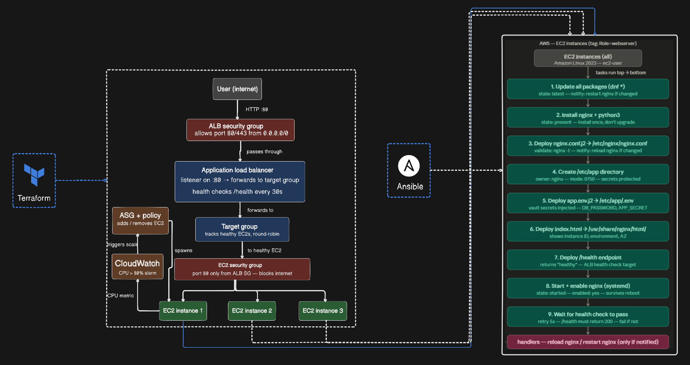
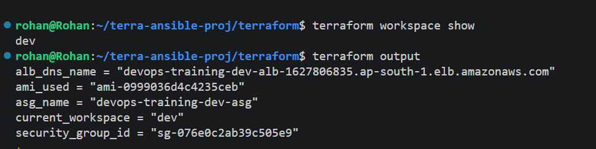
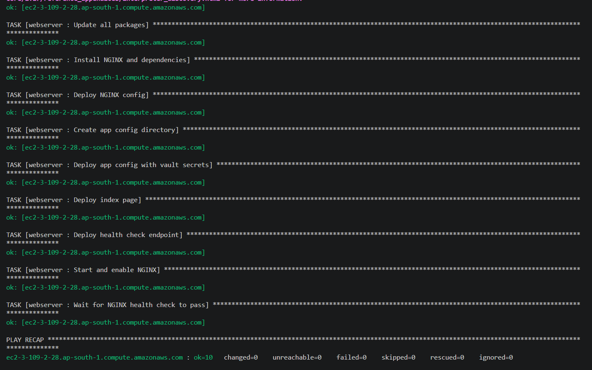
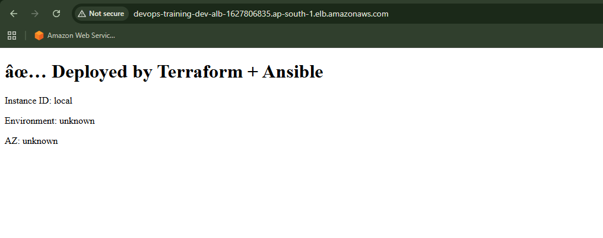

# terraform-ansible-aws-webserver

Production-grade AWS web infrastructure provisioned with Terraform and configured with Ansible. Every config file understood line by line — not just written.

---

## Architecture



---

## What This Project Does

Terraform provisions the AWS infrastructure. Ansible SSH's into every EC2 and configures it. One command deploys everything.

**Terraform handles:**
- S3 + DynamoDB for remote state and locking
- VPC, subnets, security groups
- Application Load Balancer + target group + listener
- Launch template + Auto Scaling Group
- CloudWatch alarm for CPU-based scaling
- Environment separation via workspaces (dev / staging / prod)

**Ansible handles:**
- Dynamic EC2 inventory via `aws_ec2.yml` (discovers by tag `Role=webserver`)
- Package updates and nginx installation
- nginx config deployment via Jinja2 template (`nginx.conf.j2`)
- Vault-encrypted secrets deployment (`/etc/app/.env`)
- Health check endpoint (`/health`)
- nginx systemd service management
- Post-deploy health verification

---

## Project Structure

```
├── bootstrap/                  # Creates S3 + DynamoDB for remote state
│   ├── main.tf
│   ├── variables.tf
│   ├── outputs.tf
│   └── terraform.tfvars
│
├── terraform/                  # Main infrastructure
│   ├── main.tf                 # Security groups, ALB, ASG, CloudWatch
│   ├── backend.tf              # Points to S3 remote state
│   ├── variables.tf
│   ├── outputs.tf
│   ├── terraform.tfvars
│   └── environments/
│       ├── dev.tfvars
│       ├── staging.tfvars
│       └── prod.tfvars
│
└── ansible/
    ├── ansible.cfg             # Roles path + inventory location
    ├── group_vars/
    │   └── all/
    │       ├── vars.yml        # Plain variables
    │       └── vault.yml       # Encrypted secrets (Ansible Vault)
    ├── inventory/
    │   ├── aws_ec2.yml         # Dynamic inventory — discovers EC2s from AWS
    │   └── aws_hosts.ini       # Static fallback for local testing
    ├── playbooks/
    │   └── site.yml            # Entry point
    └── roles/
        └── webserver/
            ├── tasks/main.yml
            ├── handlers/main.yml
            └── templates/
                ├── nginx.conf.j2
                └── app.env.j2
```

---

## Prerequisites

- Terraform >= 1.6.0
- Ansible >= 2.14
- AWS CLI configured (`aws configure`)
- Python 3 + `boto3` (`pip install boto3`)
- `amazon.aws` Ansible collection (`ansible-galaxy collection install amazon.aws`)
- An existing AWS key pair

---

## Usage

### Step 1 — Bootstrap remote state (run once)

```bash
cd bootstrap
terraform init
terraform apply
```

### Step 2 — Deploy infrastructure

```bash
cd terraform

# Create and select workspace
terraform workspace new dev
terraform workspace select dev

# Init and apply
terraform init
terraform apply -var-file="environments/dev.tfvars"
```

### Step 3 — Configure EC2s with Ansible

```bash
cd ansible

# Create vault password file (never commit this)
echo "your-vault-password" > vault_pass.txt

# Run playbook
ansible-playbook playbooks/site.yml --vault-password-file vault_pass.txt
```

### Step 4 — Verify

```bash
# Get ALB DNS from terraform output
terraform output alb_dns_name

# Hit the health endpoint
curl http://<alb-dns>/health
```

---

## Environments

| Environment | Min | Desired | Max | Instance |
|-------------|-----|---------|-----|----------|
| dev         | 1   | 1       | 2   | t3.micro |
| staging     | 1   | 2       | 4   | t3.micro |
| prod        | 2   | 3       | 6   | t3.micro |

---

## Outputs

| Output | Description |
|--------|-------------|
| `alb_dns_name` | ALB DNS — use this as your app URL |
| `asg_name` | Auto Scaling Group name |
| `current_workspace` | Active environment (dev/staging/prod) |
| `ami_used` | AMI ID used — useful for auditing |
| `security_group_id` | Web security group ID |

---

## Key Design Decisions

| Decision | Reason |
|----------|--------|
| EC2 security group only accepts traffic from ALB SG | Blocks direct internet access to EC2 |
| `validate: "nginx -t -c %s"` in Ansible | Tests config before saving — old config stays safe if invalid |
| `enable_deletion_protection = true` for prod ALB | Prevents accidental deletion in production |
| `for: 2m` on CloudWatch alarm | Filters brief CPU spikes — avoids unnecessary scaling |
| Dynamic inventory over static `aws_hosts.ini` | ASG spins up/down instances — IPs constantly change |
| Ansible Vault for secrets | Encrypted secrets safe to commit — password never committed |

---

## Proof of Work

<!-- Add screenshots below -->
### Terrafomr


### Ansible playbook run


### App running via ALB DNS


---

## Contact

**Rohan Deb**
📧 ruhondeb28@gmail.com
🐙 [github.com/rohandeb2](https://github.com/rohandeb2)
